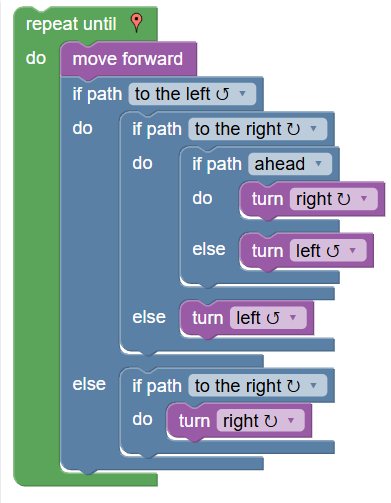

# TPC1: Maze nível 10 e Desenho no Turtle (Blockly Games)

## Autor

**Nome:** Cristiana Sofia Almeida Correia 

**ID:** A114465

  

## Resumo
O trabalho consistiu na resolução do nível 10 do jogo Maze presente no Blockly Games e na reprodução de um desenho fornecido pelo professor utilizando o jogo Turtle da mesma plataforma 

  
  

## Resultados
### Maze
A resolução do nível 10 foi realizada através dos blocos disponibilizados pelo Blockly Games. 

  
[Link para a minha resolução do Maze](https://blockly.games/maze?lang=en&level=10&&skin=0) 
